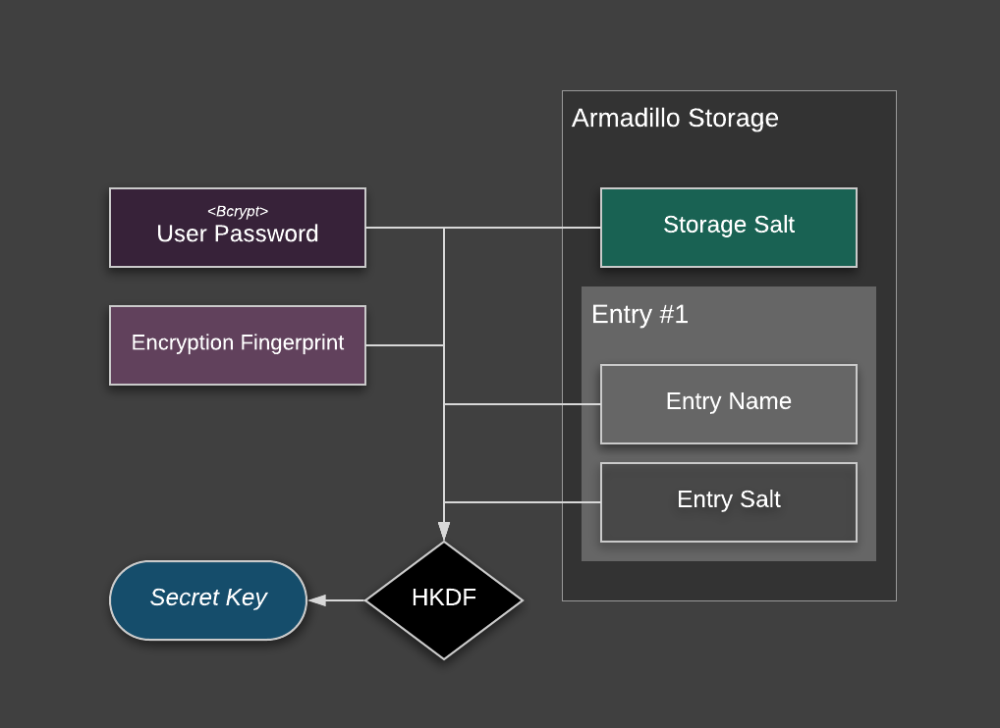
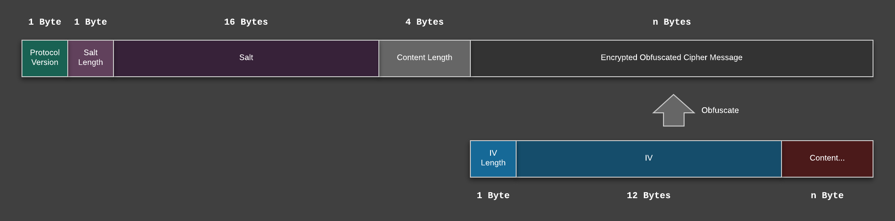

# Armadillo - Encrypted Shared Preference

A shared preference implementation for secret data providing confidentiality,
integrity and authenticity . Per default uses AES-GCM, BCrypt and HKDF as cryptographic
primitives.

[ ](https://bintray.com/patrickfav/maven/armadillo/_latestVersion)
[](https://travis-ci.org/patrickfav/armadillo)
[](https://www.javadoc.io/doc/at.favre.lib/armadillo)
[](https://coveralls.io/github/patrickfav/armadillo?branch=master)
[](https://codeclimate.com/github/patrickfav/armadillo/maintainability)

**Important Notice:** If you migrate to v0.6.0 and use a user password and
default key stretching function migration is needed due to a security issue.
See [migration guide in the changelog for v0.6.0](https://github.com/patrickfav/armadillo/releases)

## Features

* **No-Nonse State-of-the-Art Crypto**: Authenticated Encryption with [AES](https://en.wikipedia.org/wiki/Advanced_Encryption_Standard)-[GCM](https://en.wikipedia.org/wiki/Galois/Counter_Mode), key derivation functions [Bcrypt](https://en.wikipedia.org/wiki/Bcrypt) and [HKDF](https://en.wikipedia.org/wiki/HKDF)
* **Flexible**: Tons of nobs and switches while having sane defaults
* **Modular**: use your own implementation of symmetric cipher, key stretching, data obfuscation, etc.
* **Lightweight**: No massive dependencies required like [BouncyCastle](https://www.bouncycastle.org/) or [Facebook Conceal](https://github.com/facebook/conceal)

## Quick Start

Add the following to your dependencies ([add jcenter to your repositories](https://developer.android.com/studio/build/index.html#top-level) if you haven't)

```gradle
compile 'at.favre.lib:armadillo:x.y.z'
```

A very minimal example

```java
    SharedPreferences preferences = Armadillo.create(context, "myPrefs")
        .encryptionFingerprint(context)
        .build();

    preferences.edit().putString("key1", "stringValue").apply();
    String s = preferences.getString("key1", null);
```

### Advanced Example

The following example shows some of the configurations available to the developer:

```java
String userId = ...
SharedPreferences preferences = Armadillo.create(context, "myCustomPreferences")
        .password("mySuperSecretPassword".toCharArray()) //use user based password
        .securityProvider(Security.getProvider("BC")) //use bouncy-castle security provider
        .keyStretchingFunction(new PBKDF2KeyStretcher()) //use PBKDF2 as user password kdf
        .contentKeyDigest(Bytes.from(getAndroidId(context)).array()) //use custom content key digest salt
        .secureRandom(new SecureRandom()) //provide your own secure random for salt/iv generation
        .encryptionFingerprint(context, userId.getBytes(StandardCharsets.UTF_8)) //add the user id to fingerprint
        .supportVerifyPassword(true) //enables optional password validation support `.isValidPassword()`
        .enableKitKatSupport(true) //enable optional kitkat support
        .build();
```

A xml file named like `f1a4e61ffb59c6e6a3d6ceae9a20cb5726aade06.xml` will
be created with the resulting data looking something like that after the
first put operation:

```xml
<?xml version='1.0' encoding='utf-8' standalone='yes' ?>
<map>
    <!-- storage random salt -->
    <string name="39e3e4f83dda81c44f8a9063196b28b3d5091fca">4YefvCf1UJ+lVPUAEgmX9Ote9CIgWOINmXq/8s1QUNw=</string>
)     <!-- 'key1':'stringValue' -->
    <string name="152b866fd2d63899678c21f247bb6df0d2e38072">AAAAABCk6riLYVyqozCrBfCzNLuaAAAALZfqipKoXeLtCOuzX2iPa4aYII8FlWVQxORICY5AikR3ISUv/BkUnDsTSeGxAg==</string>
</map>

```

### KitKat Support

Unfortunately [Android SDK 19 (KITKAT)](https://en.wikipedia.org/wiki/Android_KitKat) does not fully support AES GCM mode.
Therefore a backwards compatible implementation of AES using [CBC](https://en.wikipedia.org/wiki/Block_cipher_mode_of_operation#Cipher_Block_Chaining_(CBC))
with [Encrypt-then-MAC](https://en.wikipedia.org/wiki/Authenticated_encryption#Encrypt-then-MAC_(EtM))
can be used to support this library on older devices. This should provide
the same security strength as the GCM version, however the support must
be enabled manually:


```java
SharedPreferences preferences = Armadillo.create(context, "myCustomPreferences")
        .enableKitKatSupport(true)
        ...
        .build();
```

In this mode, if on a KitKat device the backwards-compatible implementation is
used, the default AES-GCM version otherwise. Upgrading to a newer OS version
the content should still be decryptable, while newer content will then be
encrypted with the AES-GCM version.

## Description

### Design Choices

* **AES + GCM block mode:** To make sure that the data is not only kept
confidential, but it's integrity also preserved, the authenticated encryption
[AES+GCM](https://en.wikipedia.org/wiki/Galois/Counter_Mode) is used. GCM
can be implemented efficiently and fast and is the usually alternative to
[encrypt then mac](https://en.wikipedia.org/wiki/Authenticated_encryption#Encrypt-then-MAC_(EtM))
with AES+CBC and HMAC. The authentication tag is appended to the message and
is 16 byte long in this implementation. A downside of GCM is the requirement
to [never reuse](https://en.wikipedia.org/wiki/Galois/Counter_Mode#Security)
 a [IV](https://en.wikipedia.org/wiki/Initialization_vector) with the same key,
 which is avoided in this lib.
* **Every put operation creates a different cipher text:** Every put operation
generates new salts, iv so the the resulting cipher text will be unrecognizably
different even with the same underlying data. This makes it harder to check if
the data actually has changed.
* **KDFs with Key Stretching features for user passwords:** Add brute-force
protection to possibly weak user provided passwords.
* **Minimum SDK 19 (Android 4.4):** A way to increase security is to cap older
implementation. SDK 19 seems to be a good compromise where most of the older
[security hack fixes](https://android-developers.googleblog.com/2013/08/some-securerandom-thoughts.html)
 are not necessary anymore, but still targeting most devices.
* **Use of [JCA as Provider](https://issuetracker.google.com/issues/36983155) for cryptographic primitives:**
Various security frameworks exists in Java: [BouncyCastle](https://www.bouncycastle.org/),
[Conscrypt](https://github.com/google/conscrypt), [Facebook Conceal](https://github.com/facebook/conceal).
The problem is that these libraries are usually huge and require manual
updates to have all the latents security fixes.
This library however depends on the default JCA provider (although the developer may choose a
different one). This puts trust in the device and it's implementation, while
expecting frequent security patches. Usually the default provider since KitKat is
[`AndroidOpenSSL`]() provider which is fast (probably hardware accelerated for e.g. AES) and
heavily used by e.g. TLS implementation.
* **[Android Keystore System](https://developer.android.com/training/articles/keystore.html) is not used:**
  In my humble opinion, the Android Keystore is the best possible way to secure
  data on an Android device. Unfortunately, due to the massive fragmentation
  in the ecosystem properly handling and using the Android Keystore System
  is not easy and has [some major drawbacks](https://issuetracker.google.com/issues/36983155).
  Due to working in a security relevant field I have a lot of experience with
  this technology, therefore the decision was made to not support it _for this
  implementation_ i.e. to keep it simple.
* **Use of data obfuscation**: To disguise the actual data format and appear
as a pseudo random byte array, obfuscation is used. This deliberately uses
non standard ways to make it a bit harder to reverse engineer.

### User provided Passwords

A high entropy value not known to any system but the user is a good and strong
base for a cryptographic key. Unfortunately user-based passwords are often
weak (low-entropy). To mitigate that fact and help preventing easy brute-forcing
[key derivation functions](https://en.wikipedia.org/wiki/Key_derivation_function)
with [key stretching](https://en.wikipedia.org/wiki/Key_stretching)
properties are used. These functions calculate pseudo-random data from it's
source material which requires mandatory work.

The following implementations are available:

* [BCrypt](https://en.wikipedia.org/wiki/Bcrypt): based on blowfish, has a variable cpu cost parameter and a fixed memory cost parameter (_default_)
* [PBKDF2](https://en.wikipedia.org/wiki/PBKDF2): applies a pseudorandom function, such as hash-based message authentication code (HMAC), to the input password or passphrase along with a salt value and repeats the process many times to produce a derived key; no memory hardness

It is possible to provide any KDF implementation to the storage with providing
a custom `KeyStretchingFunction` implementation.

Note, if you use key stretching put/get operations will get very slow (depeding
on the work factor of course), so consider accessing the store in a background
thread.

### Encryption Fingerprint

This store bases part of it's security on so called fingerprinting. That
basically means, during runtime entropy from e.g. the device, system or other
parts are used to create a cryptographic key with which the data is encrypted.
It basically is encryption with a semi-secret key.

This has the following benefits:

* Binding the data to the executing runtime (ie. making it harder to lift the data and trying to read it in a different environment)
* Strongly obfuscating the data bordering actual encryption when the used fingerprint is infeasible to guess
* Be able to scope the data to a specific environment (e.g. when using the Android OS image build number, every update invalidates the data)

This store has a default implementation of `EncryptionFingerprint` which
can only use generic data. In detail the following properties are incorporated:

* Fingerprint of the [APK signature](https://source.android.com/security/apksigning/)
* [Android ID](https://developer.android.com/reference/android/provider/Settings.Secure.html#ANDROID_ID) : a 64-bit number (expressed as a hexadecimal string) byte random value; on SDK 26 and higher, unique to each combination of app-signing key, user, and device - on SDK 25 lower only unique to user and device
* [Application package name](https://developer.android.com/studio/build/application-id.html), [brand](https://developer.android.com/reference/android/os/Build.html#BRAND), [model](https://developer.android.com/reference/android/os/Build.html#MODEL) and name of the device
* 32 byte hardcoded static random value

#### Enhancing the Strength of the Encryption Fingerprint

The security of this mechanism increases considerably if the user adds it's
own data. Here are some suggestions:

* Random values hardcoded, locally generated or provided by a remote service
* Unique user-id (if the application has the concept of login)
* Device Serial (requires dangerous permission SDK > 25)
* Sim-ID/ICCID (if changing the sim should/can invalidate the data)
* Android OS image build fingerprint (if you want to invalidate the data after OS update)

### Key Derivation Process

The cryptographic key used to encrypt the data is composed of the following
parts:



* User password (optional): provided by the caller and stretched with e.g. Bcrypt
* Encryption Fingerprint (see section above)
* Entry Key: the hashed version of the key passed by the caller; this will bind the data to that specific entry key
* Entry Salt: a random 16 byte value unique to that specific entry that will be created on every put operation (will also be used for the key stretching function)
* Storage Salt: a random 32 byte value unique to that specific storage, created on first creation of the storage

The concatenated key material will be derived and stretched to the desired length
with [HKDF](https://en.wikipedia.org/wiki/HKDF) derivation function.

### Persistence Profile

#### Key

The key is hashed with [HKDF](https://en.wikipedia.org/wiki/HKDF) (which uses
Hmac with Sha512 internally) expanded to a 20 byte hash which will be encoded with
[base16 (hex)](https://en.wikipedia.org/wiki/Hexadecimal). The key generation
is salted by the encryption fingerprint, so different shared preferences will
generate different hashes for the same keys.

#### Content

The diagram below illustrates the used data format. To disguise the format
a little bit it will be obfuscated by a simple xor cipher.



The resulting data will be encoded with [base64](https://en.wikipedia.org/wiki/Base64) and looks like this in the shared preferences xml:

```xml
<?xml version='1.0' encoding='utf-8' standalone='yes' ?>
<map>
    <string name="39e3e4f83dda81c44f8a9063196b28b3d5091fca">hwbchXlqDAQcig6q3UWxdbOb2wouDGGwjUGNIzREiy0=</string>
    <string name="62ef41ac992322bdd669e96799c12a66a2cce111">IOIpvllJPY+aIwv+Z+w+SSJLxHD218vOUpd+e10eCczZURrNSN8h49V+Oy3thjEsbp/2zuqa6uNlGJ8tMpgk/uU0b+iLIciN+0EGYLKso6UYgbtgH/3n9GcQzqOvAIZvZeuurk4f9x9gL3fknHpFaXSIOYrSGZOjwD8WnOk1w2/tSufyZNSIdxUGvjniwpNaeawACi1EKitA4Oj+GRZRjW5NFY3jpYlzDPw=</string>
</map>
```

## Digital Signatures

### Signed Commits

All tags and commits by me are signed with git with my private key:

    GPG key ID: 4FDF85343912A3AB
    Fingerprint: 2FB392FB05158589B767960C4FDF85343912A3AB

## Build

Assemble the lib with the following command

    ./gradlew :armadillo:assemble

The `.aar` files can then be found in `/armadillo/build/outputs/aar` folder

## Libraries & Credits

* [BCrypt](https://github.com/patrickfav/bcrypt)
* [HKDF Standalone](https://github.com/patrickfav/hkdf)
* [Bytes](https://github.com/patrickfav/bytes-java)
* [Awesome logo made by @iqbalhood](https://github.com/iqbalhood)

## Similar Projects:

* [secure-preferences using AES-CBC](https://github.com/scottyab/secure-preferences)
* [secure-preferences supporting Android Keystore System](https://github.com/ophio/secure-preferences)
* [secure-preferences using FB Conceal framework](https://github.com/KaKaVip/secure-preferences)
* [secure-preferences supporting Android Keystore System](https://github.com/adorsys/secure-storage-android)

## Further Reading

* [Security Best Practices: Symmetric Encryption with AES in Java and Android](https://proandroiddev.com/security-best-practices-symmetric-encryption-with-aes-in-java-7616beaaade9)

# License

Copyright 2017 Patrick Favre-Bulle

Licensed under the Apache License, Version 2.0 (the "License");
you may not use this file except in compliance with the License.
You may obtain a copy of the License at

    http://www.apache.org/licenses/LICENSE-2.0

Unless required by applicable law or agreed to in writing, software
distributed under the License is distributed on an "AS IS" BASIS,
WITHOUT WARRANTIES OR CONDITIONS OF ANY KIND, either express or implied.
See the License for the specific language governing permissions and
limitations under the License.

